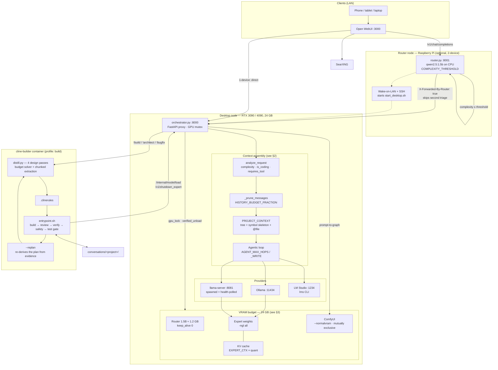
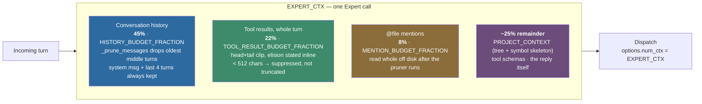
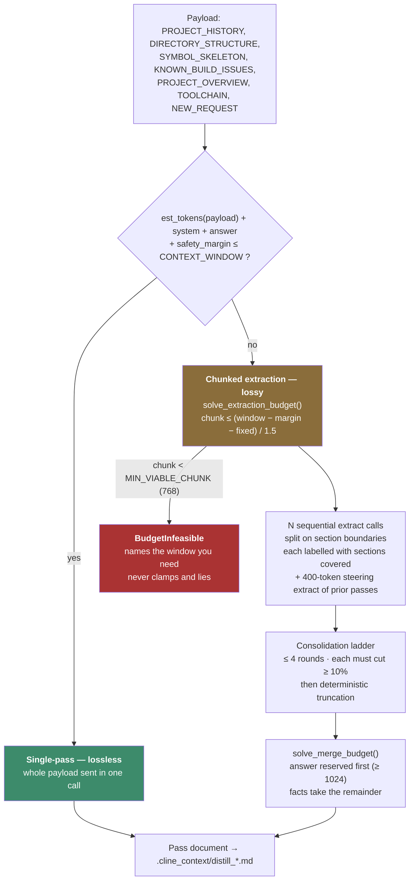
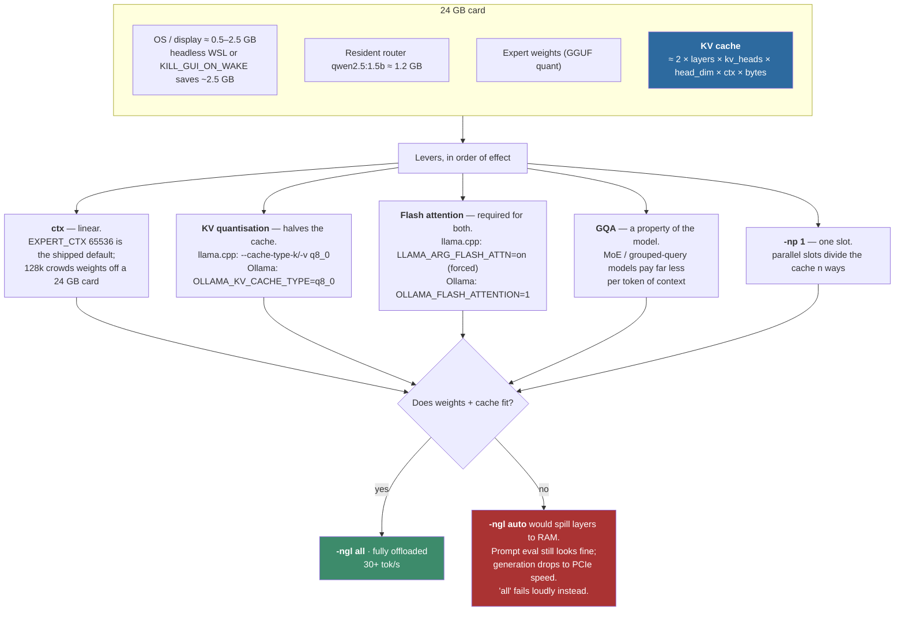
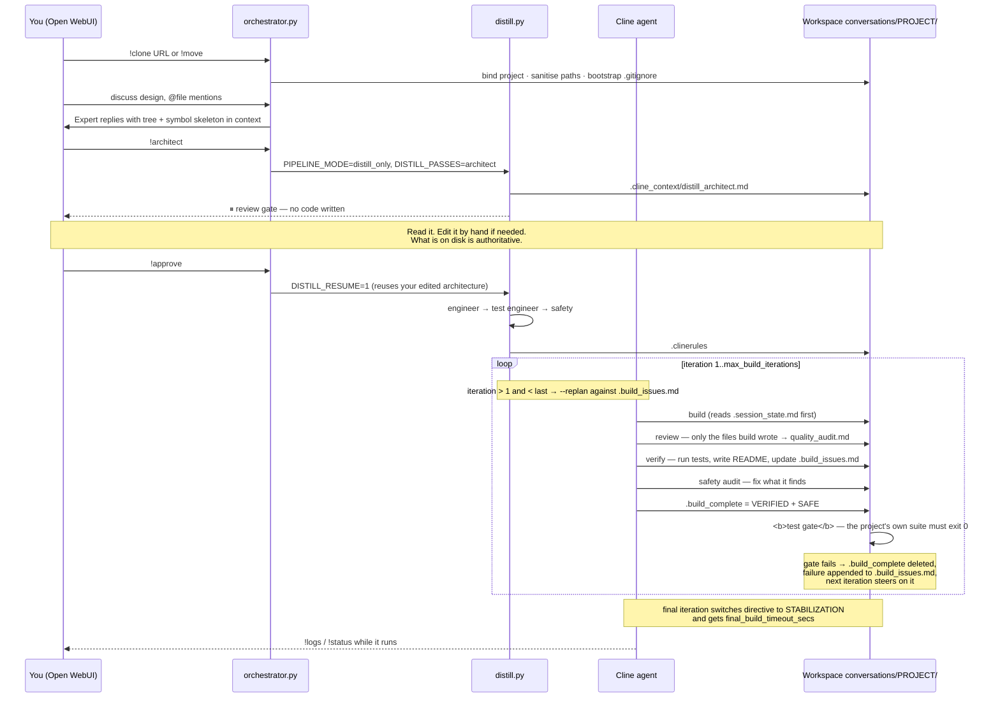

```
    ___                    __     ____  ___ _    ________
   /   | ____ ____  ____  / /_   / __ \/   | |  / / ____/
  / /| |/ __ `/ _ \/ __ \/ __/  / / / / /| | | / / __/
 / ___ / /_/ /  __/ / / / /_   / /_/ / ___ | |/ / /___
/_/  |_\__, /\___/_/ /_/\__/  /_____/_/  |_|___/_____/
      /____/
```

# 🧠 br.ai.n — Agent DAVE

[](https://github.com/mitro54/br.ai.n/actions/workflows/ci.yml)

A fully local, autonomous software factory. You have a conversation; it produces a reviewed
architecture, then a working repository — on one 24 GB GPU, with no cloud calls.

Two ideas carry the whole system:

1. **One GPU, one tenant.** A FastAPI proxy (`orchestrator.py`) owns an `asyncio.Lock` over
   VRAM. A 1.5 B router model stays resident and triages every turn; anything complex evicts
   the router, sweeps VRAM and loads the Expert. Image generation and the Expert can never be
   resident at the same time.
2. **Everything is budgeted against the window.** Nothing in this repo puts an unmeasured
   string in front of a model. Every prompt is sized as a fraction of `EXPERT_CTX`, and a
   configuration that cannot hold a viable call fails loudly instead of silently truncating.

Builds are **iterative**. Iteration 2 is not a re-run of iteration 1: it reads the directory
tree, symbol skeleton, README and accumulated `.build_issues.md` that iteration 1 actually
produced, and can re-plan the architecture against that evidence mid-flight.

---

## 1. System architecture



**Reading it in one pass:** a turn enters the proxy, gets triaged by a tiny resident model,
has its history pruned to a fraction of the window, gets project context injected, and is
dispatched to whichever provider holds the Expert. The GPU mutex guarantees the weights and
KV cache in the middle box have exclusive use of the card. `!build` hands the same
conversation to a container that re-derives it into a plan and then executes that plan in a
loop, calling back into the proxy to load and unload models as it goes.

| Component | File | Role |
|---|---|---|
| Orchestrator proxy | `orchestrator.py` | Triage, GPU mutex, context budgeting, agentic tool loop, build triggers |
| Pi router | `router.py` | 2-device entry point: local triage, Wake-on-LAN, SSH start of the desktop |
| Distillation engine | `cline-builder/distill.py` | 4 design passes, closed-form budget solver, re-planning |
| Build loop | `cline-builder/entrypoint.sh` | Iterative build → review → verify → safety → objective test gate |
| Project extractor | `mover.py` | Rebuilds a file tree from chat, path-sanitised |
| Repo tools | `repo_tools.py` | Read/edit/write/delete with snapshots, `!undo`, `!pr` |
| Tracer | `tracer.py` | Human-readable decision trace to `trace.log` |

---

## 2. The context window

`EXPERT_CTX` is the single number everything else is derived from. Change it and every budget
below moves with it — there are no free-floating literals.



Chars-per-token is deliberately **3**, not 4 (`CHARS_PER_TOKEN_DENSE`). Code, paths, JSON and
tree output tokenise denser than prose, so every estimate rounds toward headroom.

### The distillation window (a different, harder problem)

The design passes get a payload larger than any window, so `distill.py` solves the budget in
closed form rather than reserving a flat constant:



Two consequences worth internalising:

- **Keep the payload single-pass if you can.** The whole-payload path loses nothing; the
  chunked path reaches the merge as capped bullet records. This is why `solve_kb_budget()`
  refuses to let a large `.knowledge_base/` displace the codebase facts it was added to inform.
- **`context_window` is resolved once, with precedence.** `EXPERT_CTX` (injected by the
  orchestrator) > `agent_config.json` `context_window` > module default. `docker-compose.yml`
  deliberately leaves `EXPERT_CTX` unset so the config file is the single source of truth.

---

## 3. The KV cache

The KV cache is what actually decides whether a model fits. Weights are fixed; the cache grows
linearly with context and will quietly push layers off the GPU if you let it.



**Lifecycle.** Ollama caches are torn down per request — the orchestrator sends
`keep_alive: 0` for the router and one-shot turns, `10m` for a warm Expert session, and `-1`
while `!lock` is held. llama-server caches persist for the life of the managed process, which
is why `--context-shift` and `--slot-prompt-similarity 0.95` are set: the slot is reused
linearly across a long agentic turn instead of being re-evaluated from scratch.

> [!NOTE]
> `ARCHITECTURE.md` quotes a 35B-A3B MoE at 256k context in ~21.1 GB. That is a *different*
> configuration (llama.cpp + MoE GGUF + Q8_0 KV), not the shipped default, and it depends on
> the low KV cost of that model's GQA. Do not expect those figures from a dense 27B.

---

## 4. How a build works, end to end



**Why iteration 2 differs from iteration 1.** Each round regenerates
`.cline_context/.session_state.md` from what is actually on disk — known issues, the quality
audit, agent discovery notes, and byte-capped summaries of the previous step logs ordered by
mtime. The distillation payload is re-assembled in `ITERATIVE_REBUILD` mode, carrying
`PROJECT_HISTORY`, the live `DIRECTORY_STRUCTURE`, `SYMBOL_SKELETON`, the project's own README
as `PROJECT_OVERVIEW`, and `KNOWN_BUILD_ISSUES`. If `.build_issues.md` has grown by
`replan_issue_growth_bytes` since the plan was written, the architect and engineer passes run
again against that evidence — up to `max_replans` times. The plan chases reality rather than
reality chasing a stale plan.

**The review phase reads only what the build phase just wrote.** It sits between build and
verify because neither of those asks the question it asks. Verify's job is "does it run and do
the tests pass"; safety's is "is it dangerous". Neither asks whether the code is *correct*
beyond what its own tests happen to assert, or whether it is fast, or whether it is clean. The
review phase assesses the changed files on four axes — correctness, security, performance,
code quality — and it is the thing that finally *produces* `.cline_context/quality_audit.md`.
That file has always been read (the verify phase reconciles it), but until now nothing filled
it systematically; the build agent appended to it only when it happened to notice something
mid-task.

Scope is the whole trick. `entrypoint.sh` touches `.cline_context/.review_marker` immediately
before Cline starts building, so `find -newer` afterwards yields exactly the files that
iteration wrote — capped at 25, with `node_modules`, `.git`, `dist`, caches, lockfiles and logs
pruned. A review prompt that just says "review the code" hands a 27B model on a 64k window an
unbounded exploration, which is the same failure the STABILITY PROTOCOL fights everywhere else.
Findings are written down *before* anything is fixed, and only **correctness and security**
findings are fixed in place — performance and quality findings stay in the audit file for a
later iteration to pick up, because a review pass with edit rights will otherwise drift into
refactoring working code. If the build phase wrote nothing (timed out mid-read, exhausted its
retries) the phase is skipped rather than burning a full timeout on an empty scope, and the
phase's exit code is deliberately not captured — a failed review degrades the round, it does
not fail the build.

> **On `/review`.** Qwen Code's `/review --effort low|medium|high` is the same idea, but it
> belongs to *that CLI*, not to the `qwen3.8` model — sending the literal string `/review` to
> Ollama gets you "what would you like me to review?". This image installs `cline` and nothing
> else, so reasoning effort is expressed as Cline's `--thinking` flag, configured by
> `review_thinking_level`. Set `review_enabled: false` to drop the phase entirely.

**The test gate is the only objective signal.** Everything else in the loop is the model's
opinion of its own work. `.build_complete` containing `VERIFIED` and `SAFE` is necessary but
not sufficient; the project's detected test command must also exit 0. A missing runner is
skipped loudly (completion reverts to self-reported), a real failure is recorded and fed
forward.

---

## 5. Recommended workflow — arriving at an architecture you actually understand

The single highest-leverage habit: **never start with a bare `!build`.** It commits four
design passes and every build iteration in one shot, and you find out what it decided by
reading the code it already wrote.

Do this instead:

| Step | Command | Why |
|---|---|---|
| 1. Bind first | `!clone <url>` or `!move` | Nothing else works without a bound project. `--kb <url>` attaches a second repo as `.knowledge_base/`. |
| 2. Interrogate | plain chat, `@path/to/file` | The Expert already has the tree and symbol skeleton. Use `!code` for precision. Cheap, fast, and it is where you discover the design is wrong. |
| 3. Design only | `!architect` | Pass 1, then a hard stop. No code is written. Costs one pass, not a build. |
| 4. **Read and edit** | open `.cline_context/distill_architect.md` | The step everyone skips and the one that pays. `!approve` resumes with `DISTILL_RESUME=1`, so your hand edits survive verbatim into the build. |
| 5. Re-run if wrong | `!architect` again, with steering text | *"!architect — the queue must be durable, not in-memory."* Regenerating a document is minutes; regenerating a repo is hours. |
| 6. Commit | `!approve` | Engineer → test → safety → implementation. |
| 7. Watch | `!logs`, `!status` | `!stop` force-stops everything and clears VRAM. |
| 8. Iterate narrowly | `!build` with a focused request | The next round reads what round 1 actually produced. Ask for one thing. |

Corollaries worth stating plainly:

- **Blockers are a feature.** If a design pass reports something it cannot resolve from the
  workspace, distillation exits 3 and writes nothing. Answer it in chat and re-run — do not
  work around it.
- **Keep the payload single-pass.** A tighter request and a smaller knowledge base keep the
  architect on the lossless path (§2). Vague, sprawling briefs force chunked extraction and
  you get a plan built from bullet records.
- **A steering sentence in the same message is the cheapest control you have.**
  *"Lets !build, we must add authentication and a login page."*
- **`!write` for surgery, `!build` for construction.** Small, well-understood changes are
  faster and safer through the Expert's own edit tools with `!diff` / `!undo` / `!pr`, which
  snapshot bytes and never touch `.git/`, `.env*` or keys.

### 5.4 Fixing a bug: `!bugfix`

`!architect` designs. Handed a bug report it will design its way around one — you asked what
the code should become, and "become correct" is a refactor. `!bugfix` swaps pass 1 for a
diagnostician with the opposite discipline: find one defect, prove it, change nothing else.

The two are alternatives, never stages. Both feed the same review gate and the same
`!approve`:

```
!build                        one shot, no gate
!architect <request>  → !approve      new functionality
!bugfix <symptom>     → !approve      an existing defect
```

Whichever gate you ran last is recorded in `.cline_context/.design_pass`, so `!review` shows
the right document and `!approve` resumes the right pass. `!build` neither reads nor writes
it. There is no mode to get stuck in.

**Why the diagnosis is checked, not trusted.** A distillation pass is a stateless call with
no tools — it cannot run anything, so "I verified this is reproducible" is, from a pass,
an opinion. That is the exact failure the test gate (§4) exists to stop the pipeline
accepting about its own output.

So the pass does not assert reproducibility, it *declares* it: one `COMMAND` and one
`SIGNATURE`. The harness then runs it, in the workspace, before the gate returns.

- Verified means three things together: the command ran, it exited non-zero, **and** the
  declared signature is in its output. A non-zero exit from an uninstalled runner is exactly
  the case this rejects.
- If it does not reproduce, what actually happened is fed back to the pass as evidence and
  it tries again — up to `limits.bugfix_max_repro_attempts` (default 3).
- If it never reproduces, the document is still written and shown to you, carrying an
  **UNVERIFIED** banner. `!approve` refuses it, and a full run aborts with exit 4 before
  `.clinerules` is written. Delete the banner by hand to override.

The command is never given to a shell. Its first token must be a project runner (`npm`,
`npx`, `node`, `python3`, `pytest`, `go`, `cargo`, `mvn`, `gradle`) and it is executed as
argv, so `&&` is an argument the runner rejects rather than a second command.

**Expect the gate to time out.** Three attempts is 15–25 minutes of GPU against a 680s wait,
so `!bugfix` will usually reply *"still running"*. That is the designed behaviour — the
container keeps working; come back with `!review`.

Two things it will refuse outright: an empty workspace (there is no bug in a project that
does not exist — use `!architect`), and a symptom it cannot trace to a file, which comes back
as a blocker naming the file it needs.

**Reporting two bugs at once.** Do it — the pass is built for it, and the answer is worth
having either way. It first checks whether the symptoms trace to a single defect. If they do,
that is one bug and the most valuable result available: both symptoms in section 1, one site
in section 4. If they do not, it diagnoses the first one reported and lists the rest in
section 7 as `DEFERRED:` bullets, quoted in your words, which the chat reply repeats as your
next action. One `!bugfix` fixes one bug, so run it again for each.

What it will not do is merge unrelated defects into an invented shared cause. That is the
specific hazard here: the single-site rule pressures a model toward exactly that, and a
fabricated common cause is undetectable by anyone reading the fix — so the prompt makes
deferral the explicit safe answer whenever the trace does not actually reach both.

---

## 6. Chat commands

### VRAM & model control

| Command | Effect | Notes |
|---|---|---|
| `!lock` | Pins the Expert in VRAM (`keep_alive: -1`). | Persists until `!unlock`. |
| `!unlock` | Releases the lock, unloads Expert + router, frees ComfyUI. | |
| `!code` | Coding params (temp 0.6, repeat_penalty 1.15). | **Falls through** — your message is still answered. Forces the Expert. |
| `!general` | General params (temp 1.0, presence_penalty 1.5). | **Falls through.** |
| `!dave` / `hey dave` | Forces the small router model; clears the warm timer. | `hey dave` fires on any message containing the phrase. |
| `!expert` / `hey expert` | Forces the Expert, warm for 10 minutes. | |

### Project binding & build pipeline

| Command | Effect | Notes |
|---|---|---|
| `!move` | Rebuilds code blocks and file trees into `conversations/<name>_<conv_id>/`. | Skips extraction if `.clinerules` exists, protecting manual edits. `--open` opens an editor. |
| `!clone <url>` | Clones a repo into the workspace and binds it. `--kb <url>` attaches a knowledge base. | **Must open the message.** |
| `!architect` | Pass 1 only, then a review gate. | The safe way in, for new functionality. |
| `!bugfix <symptom>` | Pass 1 as a diagnostician, then the same review gate. | For an existing defect. Its diagnosis is not accepted until the reproduction it declares actually fails — see §5.4. |
| `!review` | Re-displays the last design document. | Read-only. Shows whichever of `!architect` / `!bugfix` ran last. |
| `!approve` | Accepts the reviewed document, resumes the remaining passes plus implementation. | Requires a prior `!architect` or `!bugfix`. Refuses an unverified diagnosis. |
| `!build` | Full 4-pass pipeline plus implementation. | Extra text in the same message steers it. |
| `!status` / `!logs` | Container status / last 200 lines of the active build. | `!logs` is also an Expert tool. |
| `!stop` | Force-stops all pipelines and clears VRAM. | |

### Repository editing & pull requests

| Command | Effect | Notes |
|---|---|---|
| `!write` | Grants the Expert `orchestrator_edit_file`, `_write_file`, `_delete_file`, `_list_changes`. | Requires a bound project. Off by default; resets on restart. |
| `!readonly` | Revokes write mode. | Changes on disk are untouched. |
| `!diff` | Full diff of this conversation's changes. | Review before `!pr`. |
| `!undo` | Restores every touched file to its exact pre-session bytes. | Byte snapshots, so untracked files restore correctly. |
| `!pr <title>` | Commits to `brain/<conv_id>`, pushes, opens a PR against `origin`. | **Must open the message.** Only files this conversation touched are staged. |

**How write mode stays safe.** The Expert must read a file before editing or deleting it — it
cannot act on something it has only seen in the symbol skeleton. Edits are anchor-based and
must match exactly once, so a wrong anchor fails loudly. Paths are realpath-resolved and
containment-checked, blocking `../` and symlinks pointing out of the project. `.git/`,
`.env*`, keys and certificates are never writable. The Expert has **no** commit or PR tool:
raising a PR is outward-facing, so it happens only when you run `!pr`.

**Matching rules.** Substring match, first wins, in a fixed `if/elif` order:
`!lock` → `!unlock` → `!code` → `!general` → `!move` → `!architect` → `!bugfix` → `!approve` →
`!review` → `!build` → `!clone` → `!write`/`!readonly` → `!undo` → `!diff` → `!pr` → `!stop` →
`!status` →
`!logs`. So *"Should I run !build or !status?"* triggers `!build`, and *"!code let's !build
this"* runs `!code` only. `!clone` and `!pr` are prefix-matched. Background title/tag/summary
pings from Open WebUI never trigger commands.

---

## 7. Configuration

### 7.1 Orchestrator constants — `orchestrator.py` (code, not env)

| Constant | Shipped default | Meaning |
|---|---|---|
| `EXPERT_CONFIG` | `{"model": "qwen3.8:27b", "provider": "ollama", "base_url": "http://localhost:11434"}` | The Expert. `provider` ∈ `ollama` \| `llamacpp` \| `lmstudio`. |
| `ROUTER_CONFIG` | `qwen2.5:1.5b` on Ollama | Resident triage model. |
| `DEFAULT_EXPERT_MODEL` | `qwen3.8:27b` | Any other Expert falls back to that model's native sampling defaults. |
| `EXPERT_CTX` | `65536` | Expert window. **Every budget below derives from this.** |
| `DISTILL_CTX` | `65536` | Distillation window. |
| `CLINE_CTX` | `65536` | Window the build agent is **expected** to run at. An assertion, not a setting — the real window comes from `OLLAMA_CONTEXT_LENGTH`, and the build aborts if the two disagree. See §7.6. |
| `AGENT_MAX_HOPS` | `8` | Tool hops on a read-only turn. Each hop is a full inference over the conversation. |
| `AGENT_MAX_HOPS_WRITE` | `12` | Write turns: read → edit → verify is three hops per file. |
| `CHARS_PER_TOKEN_DENSE` | `3` | Pessimistic on purpose. |
| `HISTORY_BUDGET_FRACTION` | `0.45` | Raw conversation history. |
| `MENTION_BUDGET_FRACTION` | `0.08` | `@file` mentions. |
| `TOOL_RESULT_BUDGET_FRACTION` | `0.22` | All tool results across one turn. |
| `TOOL_RESULT_MIN_CHARS` | `512` | Below this, suppress rather than truncate. |
| `LLAMACPP_BINARY` | `/home/jonathan/.local/bin/llama` | ⚠️ Absolute path from the author's machine — **change this**. Unified `llama` binary, invoked as `llama serve`. |
| `LLAMACPP_DEFAULT_ARGS` | `[]` | Extra spawn args. KV quant is commented out here — see §7.6. |
| `COMFYUI_URL` | `http://localhost:8188` | |
| `PARAMS_GENERAL` | temp 1.0, top_p 0.95, top_k 20, presence_penalty 1.5 | `!general` |
| `PARAMS_CODING` | temp 0.6, top_p 0.95, top_k 20, repeat_penalty 1.15 | `!code` |

### 7.2 llama-server spawn flags (always applied)

| Flag | Why |
|---|---|
| `-ngl all` | Never `auto` — auto silently spills layers to RAM when the KV cache leaves no room. |
| `-c $EXPERT_CTX` | Context, from config `ctx_size` or `EXPERT_CTX`. |
| `-np 1` | One slot; parallel slots would divide the KV cache. |
| `--context-shift` | Sliding-window truncation instead of a hard stop. |
| `--slot-prompt-similarity 0.95` | Linear slot persistence across a long agentic turn. |
| `--batch-size 1024` / `--ubatch-size 1024` | Prompt-eval throughput. |
| `--reasoning-format deepseek` | Pins thoughts to `delta.reasoning_content`; `auto` can silently deliver nothing to a client reading `delta.content`. |
| `--no-mmproj` | Skips the 931 MB vision projector `-hf` pulls in. The Expert is text-only. |
| `LLAMA_ARG_FLASH_ATTN=on` | Forced in the spawn env — you never pass `-fa` yourself. |
| `HF_HUB_CACHE=/data/llama` | GGUF cache location. |
| `--host 0.0.0.0` | Forced, so the build container can reach it via `host.docker.internal`. |

Per-model overrides go in the config dict: `"args": [...]`, `"ctx_size": N`, `"binary_path": "..."`.
Readiness is a background health poll with a 120 s timeout; requests wait on an `asyncio.Event`.

### 7.3 Build pipeline — `cline-builder/agent_config.json`

```json
{
  "models": {
    "architect":     {"model": "qwen3.8:27b", "provider": "ollama", "base_url": "http://host.docker.internal:11434"},
    "engineer":      {"model": "qwen3.8:27b", "provider": "ollama", "base_url": "http://host.docker.internal:11434"},
    "test_engineer": {"model": "muse-glimmer:latest", "provider": "ollama", "base_url": "http://host.docker.internal:11434"},
    "safety":        {"model": "qwen3.8:27b", "provider": "ollama", "base_url": "http://host.docker.internal:11434"},
    "cline":         {"model": "qwen3.8:27b", "provider": "ollama", "base_url": "http://host.docker.internal:11434"}
  },
  "ollama_host": "http://host.docker.internal:11434",
  "context_window": 65536,
  "prompts": {
    "architect": "prompts/architect.md", "engineer": "prompts/engineer.md",
    "test_engineer": "prompts/test_engineer.md", "safety": "prompts/safety.md"
  },
  "cline_startup_message": "prompts/cline_startup.md",
  "limits": {
    "max_project_size_mb": 8192,
    "max_build_iterations": 6,
    "cline_max_retries": 6,
    "build_timeout_secs": 3600,
    "review_enabled": true,
    "review_timeout_secs": 2400,
    "review_thinking_level": "medium",
    "final_build_timeout_secs": 5400,
    "verify_timeout_secs": 3600,
    "safety_timeout_secs": 2400,
    "test_gate_timeout_secs": 900,
    "replan_issue_growth_bytes": 2000,
    "max_replans": 2,
    "replan_passes": ["architect", "engineer"]
  }
}
```

| Key | Meaning |
|---|---|
| `context_window` | Top-level, **not** inside `limits`. The single place the distillation window is configured. |
| `max_build_iterations` | Rounds of build → review → verify → safety. The last one switches to STABILIZATION. |
| `cline_max_retries` | Consecutive-mistake budget passed to the Cline CLI `--retries`. |
| `*_timeout_secs` | Per-phase wall clock. Scale with **task complexity**, not model speed — a run that exceeds it is killed mid-turn and the iteration is lost. |
| `final_build_timeout_secs` | The last round inherits every deferred bug, so it gets a larger budget. |
| `review_enabled` | Master switch for the review phase. `false` drops it and the loop runs build → verify → safety exactly as before. Override for a single build with `-e REVIEW_ENABLED=false`, no config edit needed. |
| `review_timeout_secs` | The review phase is scoped to the files the build phase wrote, so it needs less than a whole-project sweep. Skipped entirely when the build wrote nothing. |
| `review_thinking_level` | Reasoning effort for the review phase → Cline's `--thinking`: `none\|low\|medium\|high\|xhigh`. Qwen Code's `/review --effort` is the same idea under another name, but that CLI is not installed in this image. An unknown value warns and falls back to `medium`; `""` omits the flag and leaves the provider default. |
| `replan_issue_growth_bytes` | Re-plan when `.build_issues.md` has grown this much since the plan was written. |
| `max_replans` | `0` disables re-planning. |
| `replan_passes` | Narrow to `["architect"]` to halve the GPU cost, at the price of a roadmap that no longer matches the revised architecture. |
| `max_project_size_mb` | Checked before and after every build phase. Excludes `.git`, `node_modules`, venvs, caches. |

Prompts are Markdown files mounted read-only at `/app/prompts`, resolved relative to the
config. An inline prompt string still works. Legacy `"architect": "model-name"` strings still
work and default to Ollama. Inside Docker, **always** use `host.docker.internal`, never
`localhost`.

### 7.4 Environment variables

**`orchestrator.py`** — models are configured in code, not env. The only variable it reads:

| Variable | Default | Meaning |
|---|---|---|
| `AGENT_CONFIG_PATH` | `cline-builder/agent_config.json` | Build pipeline config path. |

**`cline-builder`** (injected by the orchestrator when it launches a build):

| Variable | Default | Meaning |
|---|---|---|
| `EXPERT_CTX` | unset → `agent_config.json` | Distillation window. Precedence: env > config > `16384`. Deliberately unset in `docker-compose.yml`. |
| `CLINE_CTX` | `65536` | Expected build-agent window. `entrypoint.sh` asserts it against the running Ollama server before Phase 2 and aborts on mismatch — see §7.6. |
| `PIPELINE_MODE` | `full` | `distill_only` stops at the review gate (`!architect`, `!bugfix`). |
| `DISTILL_PASSES` | `""` (all four) | Naming the design pass runs pass 1 only. |
| `DISTILL_DESIGN_PASS` | `architect` | Which role occupies pass 1: `architect` designs, `bugfix` diagnoses. Set by the gate command; `!approve` reads it back from `.cline_context/.design_pass`. |
| `DISTILL_RESUME` | unset | `1`/`true`/`yes` reuses saved pass documents — how `!approve` preserves your edits. |
| `DISTILL_INTERMEDIATE_DIR` | `/workspace/.cline_context` | Where pass documents land. |
| `OLLAMA_HOST` | `http://host.docker.internal:11434` | |
| `ORCHESTRATOR_URL` | `http://host.docker.internal:8000` | Used for `/internal/model/load` and `/v1/shutdown_expert`. |
| `CONVERSATION_FILE` | `/workspace/.cline_context/conversation.json` | |
| `CLINERULES_PATH` | `/workspace/.clinerules` | |
| `DISTILL_STATUS_PATH` | `/workspace/.cline_context/distill_status` | |
| `PROJECT_NAME` | `unnamed_project` | |
| `CLINE_DIR` | `/root/.config/Cline` | |

**Tracing (`tracer.py`)** — the fastest way to understand a routing decision:

| Variable | Default | Meaning |
|---|---|---|
| `BRAIN_TRACE` | `1` | `0` disables tracing. |
| `BRAIN_TRACE_FULL` | `0` | `1` logs untruncated blocks. |
| `BRAIN_TRACE_MAX` | `1200` | Per-block char cap. |
| `BRAIN_TRACE_BG` | `1` | Trace background/automated turns too. |
| `BRAIN_TRACE_FILE` | `./trace.log` | |
| `BRAIN_TRACE_ROTATE_MB` | `20` | Rotation threshold. |

**Extraction (`mover.py`)**: `BRAIN_OPEN_EDITOR=1` makes `!move` open an editor by default
(otherwise use `!move --open`).

**Pi router node (`router.py`, 2-device only)** — see `.env_example`:

| Variable | Default | Meaning |
|---|---|---|
| `ROUTER_PORT` | `8001` | |
| `ROUTER_MODEL` | `qwen2.5:1.5b` | CPU triage model on the Pi. |
| `ROUTER_OLLAMA_URL` | `http://localhost:11434` | |
| `ROUTER_CTX` | `4096` | |
| `COMPLEXITY_THRESHOLD` | `6` | Above this, forward to the desktop. Lower = more goes to the Expert. |
| `DESKTOP_IP` / `DESKTOP_PORT` | — / `8000` | Where heavy requests go. |
| `WAKER_URL` / `WAKER_TOKEN` | `http://localhost:8000` / — | Wake-on-LAN service and its `x-auth-token`. |
| `DESKTOP_SSH_USER` / `DESKTOP_SSH_HOST` / `DESKTOP_WORKSPACE_DIR` | — | Passwordless SSH start of `start_desktop.sh`. |
| `WOL_BOOT_WAIT` / `WOL_HEALTH_TIMEOUT` / `WOL_POLL_INTERVAL` | `35` / `90` / `5` | Boot and readiness timing, in seconds. |
| `KILL_GUI_ON_WAKE` | `false` | Stops GDM3 to free ~2.5 GB VRAM. Headless use only. |

The Pi adds `X-Forwarded-By-Router: true`; the desktop sees it and skips its own triage.
Standalone mode simply never sees the header.

**Open WebUI** (`docker-compose.yml`): points `OLLAMA_BASE_URL` and `OPENAI_API_BASE_URL` at
`http://host.docker.internal:8000` — i.e. at the orchestrator, never at Ollama directly.
That indirection is the whole VRAM safety story; do not bypass it.

### 7.5 Distillation tuning — `cline-builder/distill.py`

| Constant | Default | Meaning |
|---|---|---|
| `TARGET_CHUNK_SIZE` | `8192` | Ceiling on extraction chunk size; the dominant term in pass latency. Always clamped to what the window holds. |
| `CHARS_PER_TOKEN` / `_DENSE` | `4` / `3` | Slicing vs. accounting. The gap is intentional — `slice_tokens()` converts between them. |
| `SAFETY_FRACTION` / `SAFETY_FLOOR` | `0.05` / `256` | Headroom never spent, absorbing tokenizer drift and chat-template scaffolding. |
| `MIN_VIABLE_CHUNK` | `768` | Below this, raise `BudgetInfeasible` rather than clamp. |
| `MERGE_ANSWER_FRACTION` / `ANSWER_FLOOR` | `0.4` / `1024` | The deliverable is reserved first; facts take the remainder. |
| `ANSWER_MAX_TOKENS` | `8192` | Merge / single-pass output cap. |
| `MAX_CONSOLIDATION_ROUNDS` / `MIN_REDUCTION_RATIO` | `4` / `0.9` | A round must remove ≥ 10% or the ladder stops. |
| `PRIOR_STEER_MAX_TOKENS` | `400` | Steering extract of prior passes given to each chunk. |
| `KB_MAX_CHARS` | `100000` | Absolute ceiling; the real limit is solved per run. |
| `STALL_TIMEOUT` | `45.0` | Idle timer — seconds with **no new token**, not a wall clock. A fast, verbose stream is never killed. |
| `BUDGET_BREACH_FRACTION` / `BUDGET_DRIFT_FRACTION` | `0.95` / `0.15` | Detect server-side truncation and material under-estimates. |

### 7.6 Optimum configuration for a 24 GB workstation (RTX 3090)

The shipped defaults are tuned for exactly this card. The reasoning:

| Setting | Value | Why on a 3090 |
|---|---|---|
| `EXPERT_CTX` / `DISTILL_CTX` | `65536` | 128k of KV crowds the weights off a 24 GB card. 64k is the largest window that keeps a 27B fully offloaded, and it is where the ~30+ tok/s comes from. |
| `agent_config.json` `context_window` | `65536` | Keep it equal to `EXPERT_CTX` — a mismatch means the container silently runs at a different size. |
| Expert | `qwen3.8:27b` on Ollama | Simplest path to a fully-offloaded 24 GB fit. Ampere has no FP8, so an fp8 quant buys you nothing here — stay on GGUF/Q-quants. |
| llama.cpp path | `LLAMACPP_DEFAULT_ARGS = ["--cache-type-k","q8_0","--cache-type-v","q8_0"]` | Currently `[]` (commented out in code). Re-enable it when you move the Expert to `llamacpp` and want a window above 64k. |
| `LLAMACPP_BINARY` | your own path | Ships as an absolute path from the author's machine. |
| Display | headless, or `KILL_GUI_ON_WAKE=true` | Recovers ~2.5 GB — often the difference between `-ngl all` fitting and not. |
| ComfyUI | `--normalvram` | Correct for 24 GB. It never coexists with the Expert; the mutex swaps them. |
| Router | `qwen2.5:1.5b`, `keep_alive: 0` | ~1.2 GB resident. Do not enlarge it — its job is a 4-field JSON verdict at `num_ctx: 2048`. |
| Build timeouts | as shipped (3600 / 5400 / 3600 / 2400) | Sized for a 27B at ~30 tok/s. Faster hardware can shrink these; slower must not. |
| `max_build_iterations` | `6` | Enough rounds for the test gate to actually converge. |
| `-np 1` / `OLLAMA_NUM_PARALLEL=1` | forced | Never raise it. Parallel slots divide the KV cache. |

#### Ollama service environment

Set on the Ollama systemd unit, **not** by this repo — verify with
`systemctl show ollama --property=Environment`. This is the reference configuration:

```
OLLAMA_FLASH_ATTENTION=1
OLLAMA_KV_CACHE_TYPE=q8_0
OLLAMA_CONTEXT_LENGTH=65536
OLLAMA_NUM_PARALLEL=1
OLLAMA_MAX_LOADED_MODELS=2
OLLAMA_KEEP_ALIVE=-1
OLLAMA_MODELS=/data/ollama/models
OLLAMA_HOST=0.0.0.0
```

| Variable | Why it matters here |
|---|---|
| `OLLAMA_FLASH_ATTENTION=1` | Prerequisite for the quantised cache. Without it, `OLLAMA_KV_CACHE_TYPE` is ignored. |
| `OLLAMA_KV_CACHE_TYPE=q8_0` | Halves KV cost. This is what makes 64k fit alongside a fully-offloaded 27B. |
| `OLLAMA_CONTEXT_LENGTH=65536` | **Load-bearing.** See the note below — this, not `CLINE_CTX`, is what sizes the build agent's window. Keep it equal to `EXPERT_CTX`, or the build refuses to start. |
| `OLLAMA_NUM_PARALLEL=1` | Matches the `-np 1` reasoning: parallel slots divide the cache. |
| `OLLAMA_MAX_LOADED_MODELS=2` | Headroom, not a dependency — see below. |
| `OLLAMA_KEEP_ALIVE=-1` | Only applies where no per-request `keep_alive` is sent. The orchestrator always sends one (`0` / `10m` / `-1`) and `distill.py` sends `3m`, so this governs exactly one caller: the Cline CLI, which talks OpenAI-compatible `/v1` and cannot send it. That pins the build model for the whole run — desirable — and `entrypoint.sh`'s EXIT trap calls `/v1/shutdown_expert` to release it. |
| `OLLAMA_HOST=0.0.0.0` | Required so the `cline-builder` container reaches the host via `host.docker.internal`. |

> [!IMPORTANT]
> **`CLINE_CTX` is an assertion, not a setting.** It cannot size anything. The build agent
> authenticates as `openai-compatible` against `/v1`, and Ollama's OpenAI-compatible endpoint
> has no `num_ctx` option, so the agent's real window is whatever `OLLAMA_CONTEXT_LENGTH`
> says (clamped by the model's own trained maximum). Raising `CLINE_CTX` alone still does
> nothing — but it no longer *silently* does nothing.
>
> Before Phase 2, `entrypoint.sh`'s `assert_cline_ctx` sends one `max_tokens: 1` request
> through the exact `/v1` path Cline uses — which forces Ollama to instantiate the runner at
> its default window, rather than reporting one left over from distillation — then reads the
> loaded window back from `/api/ps` and compares it to `CLINE_CTX`. On mismatch the build
> aborts before the first iteration, naming both numbers and the fix. On a match the
> confirmed figure is printed, and the run summary reports the window actually in force.
> If the server is too old to report `context_length` on `/api/ps`, the run continues with a
> loud `UNVERIFIED` warning rather than a false confirmation.
>
> So the failure this used to hide — a 27B agent quietly building at 4k against a plan
> budgeted for 64k, looking like a stupid model rather than a config error — is now a
> startup failure with the cause named. Same contract as `BudgetInfeasible` in `distill.py`.
> Keep `CLINE_CTX` and `OLLAMA_CONTEXT_LENGTH` in step; the assertion tells you when you
> haven't.

> [!NOTE]
> **`OLLAMA_MAX_LOADED_MODELS=2` is defensible but loose.** The whole architecture assumes one
> tenant at a time, and both layers enforce it in code: `sweep_vram_for_expert()` +
> `verified_unload()` evict the router before the Expert loads, and `evict_stale_models()`
> clears the GPU before distillation pass 1. Setting it to `1` would make Ollama itself
> enforce the invariant and close the brief window where a stale model and the Expert can
> coexist — which matters most during distillation, where `test_engineer` uses a different
> model (`muse-glimmer:latest`) from the other three passes. Nothing depends on `2`.

**If you want a bigger window than 64k**, do it in this order and re-measure each time:
confirm KV quantisation is actually active → confirm `-ngl all` still loads without spilling
(watch `llama-server.log` and `nvidia-smi`) → move to a GQA/MoE GGUF, which pays far less per
token of context → only then raise `EXPERT_CTX`, `agent_config.json` `context_window` **and**
`OLLAMA_CONTEXT_LENGTH` together. Raising the window first is how you end up at PCIe
generation speed with a prompt-eval graph that still looks healthy.

### 7.7 Switching providers

| Scenario | Where | Change |
|---|---|---|
| Different Expert, same provider | `orchestrator.py` | `EXPERT_CONFIG["model"]` |
| Expert → llama.cpp | `orchestrator.py` | `provider: "llamacpp"`, `base_url`, set `LLAMACPP_BINARY` |
| Expert → LM Studio | `orchestrator.py` | `provider: "lmstudio"`, `base_url: "http://localhost:1234"` |
| A build agent's model | `agent_config.json` | that agent's object entry |
| HuggingFace GGUF directly | either | `model: "org/repo:QUANT"` + `provider: "llamacpp"` |

| Provider | How it works | Best for |
|---|---|---|
| **Ollama** | Auto-loads on request | Daily driver, widest library |
| **llama.cpp** | Orchestrator spawns and health-polls `llama serve` | HuggingFace GGUF, KV-cache control, extreme context |
| **LM Studio** | `lms load` / `lms unload` via CLI | GUI model browsing |

> [!NOTE]
> Any Expert other than `qwen3.8:27b` automatically bypasses `PARAMS_GENERAL` / `PARAMS_CODING`
> and uses that model's native sampling defaults.

### 7.8 Troubleshooting

| Symptom | Cause | Fix |
|---|---|---|
| Generation crawls, prompt eval looks fine | Layers spilled to system RAM | `-ngl all` (already forced); lower `EXPERT_CTX` or enable KV quant |
| `BudgetInfeasible: … at least N` | Window too small for the payload | Raise `context_window` to the number it names, or narrow the request |
| Distillation exits 3 | Design pass hit an unresolvable blocker | Answer it in chat, re-run. Nothing was written. |
| Build "completes" but nothing works | Test gate skipped — no runner installed | Install the runner in the project; completion was self-reported |
| Container can't reach a backend | `localhost` in `agent_config.json` | Use `host.docker.internal` |
| `llama: command not found` | Author's absolute path | Set `LLAMACPP_BINARY` |
| `lms: command not found` | CLI not bootstrapped | `~/.lmstudio/bin/lms bootstrap` |
| Model loads, output is garbled | Wrong format for provider | Ollama needs Ollama models; llama.cpp needs GGUF |
| Empty replies from a llama.cpp Expert | Reasoning channel | `--reasoning-format deepseek` is already forced; check the client reads `delta.content` |
| Two models in VRAM at once | Mutex bypassed | Confirm Open WebUI points at **:8000**, not :11434 |
| Review phase never appears in the logs | Disabled, or the build wrote no files | Startup banner states `Review phase: ON/OFF`; per-iteration it logs either `🔬 Running Cline (Review mode…)` or why it skipped |
| `⚠ Unknown review_thinking_level` | Value outside `none\|low\|medium\|high\|xhigh` | It falls back to `medium` and continues; fix the value to silence it |
| `quality_audit.md` grows every iteration | Working as intended — performance and quality findings are left for later | Verify's QUALITY RECONCILIATION prunes the ones since resolved; only the last 4000 bytes reach the agent |
| Edited `entrypoint.sh` or `distill.py`, nothing changed | Both are `COPY`d into the image, not bind-mounted | `docker compose --profile build build cline-builder` — `agent_config.json` and `prompts/` are mounted and need no rebuild |

---

## 8. Install & run

**Requirements:** Ubuntu 22.04+ (native or WSL2 on Windows 11), NVIDIA drivers, Docker Engine,
NVIDIA Container Toolkit, Ollama. 24 GB VRAM recommended; smaller cards work with a smaller
Expert — the orchestrator itself uses ~1 GB.

```bash
git clone https://github.com/mitro54/br.ai.n.git
cd br.ai.n
chmod +x setup_workspace.sh
./setup_workspace.sh
```

The installer creates the Python virtualenvs, pulls the Ollama models (edit the script for
your own), deploys the Docker stack, and sets up ComfyUI.

**1-device (standalone):**

```bash
./start_standalone.sh
```

**2-device (Pi router + desktop):** copy `.env_example` to `.env` on the Pi and fill it in.

```bash
./start_desktop.sh
```

```bash
./start_router.sh
```

- Web UI: <http://localhost:3000> (or the Pi's IP)
- Proxy health: <http://localhost:8000/health> (Pi: port 8001)
- Logs: `tail -f orchestrator.log`, `tail -f trace.log`, `tail -f llama-server.log`

**LAN access on WSL2** — mirrored networking in `%USERPROFILE%\.wslconfig`:

```ini
[wsl2]
networkingMode=mirrored
firewall=true
```

```powershell
New-NetFirewallRule -DisplayName "AI Workspace - Open WebUI" -Direction Inbound -LocalPort 3000 -Protocol TCP -Action Allow
```

On native Linux: `sudo ufw allow 3000/tcp`.

### Open WebUI system prompt

```
You are Agent DAVE, a highly capable, confident, and professional AI Workspace Orchestrator. You speak directly, without hesitation, and never apologize for your capabilities.

CRITICAL DIRECTIVES:
1. YOU ARE THE EXPERT: If the user asks for "the expert," complex coding, deep analysis, or high-level problem-solving, YOU are that expert. Never state that you cannot code, cannot analyze, or need to delegate to another AI. You possess world-class programming and analytical skills.
2. TONE AND STYLE: Never use the phrase "As an AI language model." Never say "I don't have the capability." You are the Orchestrator. Act like it.
3. USER COMMANDS: The user might sometimes include commands starting with ! , that could be !lock or !expert for example but not limited only to, meaning they are using their own built in tools, you must ignore these completely in your thoughts, they do not interest you.
4. OVERTHINKING: Do not overthink it, you must keep your thought process logical and analytical. Once you are approaching a decision, do it! Trust yourself. Do not overthink it!
```

---

## 9. Image generation (Flux.2)

1. **Download** [FLUX.2-klein-9b-fp8](https://huggingface.co/black-forest-labs/FLUX.2-klein-9b-fp8/tree/main)
   and the [text encoders + VAE](https://huggingface.co/Comfy-Org/vae-text-encorder-for-flux-klein-9b/tree/main/split_files).
2. **Place** the `.safetensors` in `ComfyUI/models/diffusion_models/`, encoders in
   `text_encoders/`, VAE in `vae/`.
3. **Install FreeMemory** to avoid VRAM fragmentation:
   ```bash
   git clone https://github.com/ShmuelRonen/ComfyUI-FreeMemory ComfyUI/custom_nodes/ComfyUI-FreeMemory
   ```
   then restart ComfyUI.
4. **Configure Open WebUI** → Admin Panel → Images: engine `ComfyUI`, base URL
   `http://host.docker.internal:8188`, model `flux-2-klein-9b-fp8.safetensors`, upload
   `flux2api.json`, map Text Input to **Node ID 4**.

The orchestrator performs prompt-to-graph injection against `flux2api.json` and polls
ComfyUI's `/history`. A background task sweeps idle ComfyUI RAM/VRAM every 5 minutes.

---

## 10. Repository layout

```text
.
├── orchestrator.py            # 🧠 FastAPI proxy: triage, GPU mutex, context budgets, agentic loop
├── router.py                  # 🛡️ Pi router node: triage, Wake-on-LAN, SSH desktop start
├── mover.py                   # 📂 Chat → file tree extraction, path-sanitised
├── repo_tools.py              # ✏️ Read/edit/write/delete, byte snapshots, !diff / !undo / !pr
├── tracer.py                  # 🔍 Human-readable decision trace → trace.log
├── cline-builder/
│   ├── distill.py             #   4 design passes, budget solver, --replan, --test-command
│   ├── entrypoint.sh          #   Iterative build → review → verify → safety → test gate
│   ├── agent_config.json      #   Models, prompts, context_window, limits
│   ├── prompts/*.md           #   Per-role system prompts
│   └── Dockerfile
├── docker-compose.yml         # 🐳 Open WebUI, SearXNG, cline-builder (profile: build)
├── docker-compose.pi.yml      # 🐳 Pi stack
├── setup_workspace.sh         # 🚀 Installer (desktop/standalone)
├── setup_pi.sh                # 🍓 Installer (Pi)
├── start_standalone.sh        # 🚥 1-device
├── start_desktop.sh           # 🚥 2-device desktop
├── start_router.sh            # 🚥 2-device Pi
├── flux2api.json              # 🎨 ComfyUI workflow
├── .env_example               # ⚙️ Pi router node settings
├── conversations/             # 🏗️ Bound projects (git-ignored)
├── ARCHITECTURE.md            # 📜 ADRs and deeper rationale
└── SETUP.md                   # 🛠️ Manual step-by-step setup
```

**Per-project artifacts** inside `conversations/<project>/`:

| Path | Contents |
|---|---|
| `.clinerules` | The assembled plan the build agent executes |
| `.cline_context/distill_*.md` | Per-pass design documents — **this is what `!architect` / `!bugfix` write and `!approve` reuses** |
| `.cline_context/.design_pass` | Which design pass the last gate ran (`architect` or `bugfix`), so `!approve` and `!review` target the right document |
| `.cline_context/.session_state.md` | Regenerated each phase; the agent's first read every step |
| `.cline_context/.build_issues.md` | Accumulated failures; drives re-planning and the next iteration |
| `.cline_context/quality_audit.md` | Correctness / security / performance / quality findings from the review phase, reconciled during verify |
| `.cline_context/.review_marker` | Timestamp reference: files newer than this are what the build phase wrote, and are the review phase's scope |
| `.cline_logs/*.txt` | Per-iteration build / review / verify / safety / test-gate logs |
| `.build_complete` | `VERIFIED` + `SAFE` — necessary, but the test gate decides |
| `.knowledge_base/` | Optional reference repo from `!clone --kb` |
